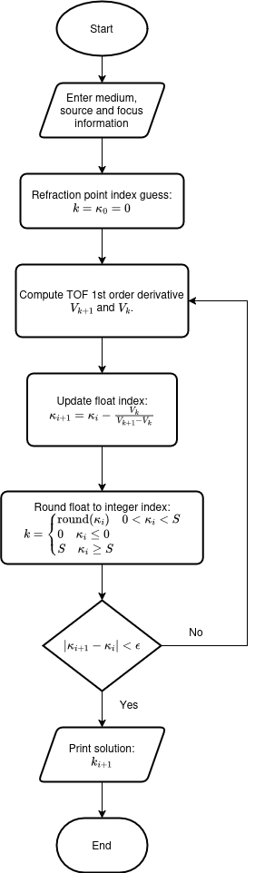
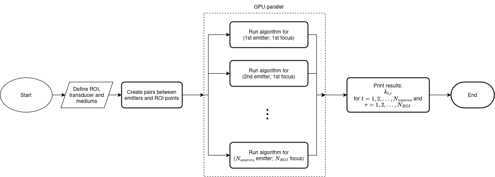
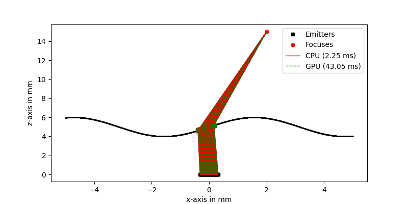
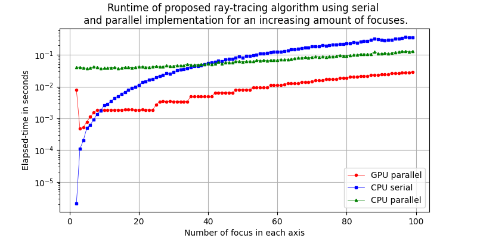

# 0. Ultrasonic ray-tracing in GPU.


## 0.1 PT-BR version:
Nesse repositório contém o código referente à disciplina "Computação em GPU" (GPU28EE) ministrada pelo professor 
*Giovanni Alfredo Guarneri*, no último semestre de 2024. 

O problema paralelizado foi encontrar o ponto onde ocorre a refração entre dois meios, considerando que a divisão entre
os meios pode ser definida por uma série de pontos, e o ponto inicial (emissor) e final (foco) são conhecidos.

## 0.2 EN version: 


# 1. Introduction <a name="introduction"></a>

Most image reconstruction algorithms for ultrasound (US) data depends on knowing the time which the soundwave takes
to propagate from the source of the wave to a point in space, usually called Time Of Flight (TOF). When the source and
the point of interest, called focus, are in a single isotropic medium, the TOF is simply computed by

$$
\tau_{single}=\frac{\sqrt{(x_F-x_A)^2+(z_F-x_A)^2}}{c},
$$

where $c$ is the propagation speed of the soundwave and $(x_F,z_F)$, $(x_A,z_A)$ are the coordinates of the source and 
focus, respectively.

When M mediums are involved, the propagation path must follow Snell's rule, depending on each medium 
propagation speed, as well as the refraction profile shape:

$$
\tau_{multiple}=\frac{\sqrt{(x_F-x_1)^2+(z_F-x_1)^2}}{c_1} + \dots + \frac{\sqrt{(x_F-x_{M-1})^2+(z_F-x_{M-1})^2}}{c_M},
$$

where $(x_1,z_1), \dots (x_{M-1},z_{M-1})$ are the surface points where refraction occurred.

In real-world problems the emitter and focus coordinates are likely to be known, hence to compute the TOF one must 
discover the refraction points.

# 2. Modelling <a name="modelling"></a>

Consider a two-medium environment, where the soundwave propagates in each medium with speed $c_1$ and $c_2$. The media
are separated by a profile described by a set of S points $(x_S,z_S)$. The TOF between an emitter at 
$A=(x_A,z_A)$ to a focus point $F=(x_F,z_F)$ through the k-th surface point is

$$
\tau(x_k,z_k)=\frac{1}{c_1}\sqrt{(x_A-x_k)^2+(z_A-z_k)^2} + \frac{1}{c_2}\sqrt{(x_F-x_k)^2+(z_F-z_k)^2},
$$

where $k=1,2,\dots,S$.

Fermat's principle states that the ray which obeys the Snell's rule is the one with minimum TOF. Therefore, one way of 
finding a valid path is by casting the ray-tracing problem as an optimization problem, i.e.:

$$
\hat k =\min_{k} \tau(x_k,z_k).
$$

Parrilla et al [1] solved the non-linear optimization problem through Newton-Raphson. His method has a simple
formulation, but becomes numerical unstable under circumstances such as complex geometries.

Instead of just considering the S-points which described the surface, lets defined a continuous function $f(x)$ that exists
in $[x_1,x_S]$. For instance, if $f(x)$ is a piece-wise linear interpolator,

$$
f(x)= 
\begin{cases}
\frac{z_2-z_1}{x_2-x_1} \cdot x \quad x_1 \leq x \leq x_2\\
\vdots \\
\frac{z_S-z_{S-1}}{x_{S}-x_{S-1}} \cdot x \quad x_{S-1} \leq x \leq x_{S}\\
\end{cases},
$$

which results in $z_k=f(x_k)$ for every $k=1,2,\dots,S$.

Then, the derivative of the TOF at $x_k$ is:
$$
V_k=\frac{d\tau(x_k)}{dx} = \frac{1}{c_1}\frac{(x_k-x_A)-\frac{df(x_k)}{dx}(f(x_k)-z_A)}{\sqrt{(x_A-x_k)^2+(z_A-f(x_k))^2}} + \frac{1}{c_2}\frac{(x_k-x_F)-\frac{df(x_k)}{dx}(f(x_k)-z_F)}{\sqrt{(x_F-x_k)^2+(z_F-f(x_k))^2}}.
$$

where the derivative of $f(.)$ is:

$$
\frac{df(x)}{dx} = \frac{f(x)+f(x+\Delta)}{\Delta}
$$

and

$$
\Delta < \min(x_2 - x_1, x_3 - x_2, \dots, x_S - x_{S-1}). 
$$

Assuming the second-order derivative of the TOF is equivalent to

$$
\frac{d^2\tau(x_k)}{dx^2} \approx \frac{V_{k+1}-V_k}{1},
$$

and combining the previous equations, it is possible to find a non-integer index $\kappa_i$ at which the TOF is minimal
through Newton-Raphson iterative method:

$$
\kappa_i = \kappa_{i+1} - \frac{V_k}{V_{k+1}-V_k}
$$

Since $\kappa_i$ can assume non-integer values, the conversion to index $k_i$ is given by 

$$
k_i = \begin{cases}
\text{round}(\kappa_i) \quad 0 < \kappa_i < S \\
0 \quad \kappa_i \leq 0 \\
S \quad \kappa_i \geq S
\end{cases}
$$

The algorithm is summarized in the diagram bellow:




# 3. Parallel implementation <a name="parallel"></a>

The modelling assumes a single emitter and focus, but this does not represent the real scale of problems encountered in 
practice. For linear phased array transducer, the number of emitters normally range from 32 to 128 elements. For methods 
such as Total Focusing Method, the number of focus easily reaches scales such as $50 \times 50$, $500 \times 500$ and 
even more. Lately parallel programming has been employed as a mean to keep computational time feasible.

Fortunately, the ray-tracing problem as stated previously is completely independent for each emitter focus pair—an ideal
scenario for parallel implementation.

In this work for each processing unit of the GPU and CPU parallel implementation will run the Newthon-Raphson algorithm
for a different emitter focus pair. The bellow Figure shows a diagram of the parallel implementation.



# 4. Experiment and Results <a name="results"></a>

I developed a test scenario to try the algorithm validity, as well as computing the speed-up obtained by implementing 
the code in parallel architecture.

The two mediums were considered to be water ($c_1=1.483$ mm/$\mu$s) and steel ($c_2=5.900$ mm/$\mu$s). The medium profile
is defined by $f(x)=\sin(x)+5$, where $x\in[-5,5]$ mm, sampled at $\Delta x = 1 \cdot 10^{-3}$ mm. The Figure bellow
contains a diagram with the main steps of the ray-tracing parallel algorithm.

All the results were obtained using a 12th Gen Intel Core i5-12450H (12 cores), with 16 GB 2666 MHz DDR4 RAM and
a NVIDIA GeForce RTX 3050 Laptop GPU 4 GB GDDR6 VRAM (2048 CUDA cores).

## 4.1 First Experiment: Single-focusing

The first experiment consider a single focus within the steel at $x_F,z_F=(2, 15)$ mm. The source is a linear phased
array transducer with 64 elements and a inter-element distance of $0.05$ mm. The goal of this experiment is to
generate the set of TOF required to compute a focused wave delay law. 

The final result is shown in the Figure bellow, where red rays are obtained by CPU serial implementation, 
while dark-green rays by GPU parallel implementation; upon close inspection, it is possible to notice that the rays 
are virtually identical. The number of emitter-focus pair is $64$, thus the CPU serial implementation yields a 
lower computational time when compared to the GPU parallel implementation.



## 4.2 Second Experiment: Parallel speed-up.

The second experiment aims to show the speed-up obtained by parallel computing. A punctual source is considered at 
$(x_A, z_A) = (0, 0)$. Instead of a single focus, multiple focus
are considered. They range from $x_F\in[2, 7]$ mm and $z_F \in [15, 25]$ mm, and they form a progressively denser grid.
For each axis, the number of focus increases linearly from $2$ to $100$, and as the grid comprehends is the total
combination of all possibles $x_F$ and $z_F$ the total number of focuses increases quadratically. Five realizations 
of the same experiment is performed to compute the average elapsed-time. The result is shown in the Figure bellow.



For lower number of focuses, the parallelization overhead makes the serial implementation faster. However, as the number
increases, the GPU quickly overcome the runtime difference at around 100 focuses (10 point for each axis). On the other
side, the CPU parallel implementation takes longer to have a lower runtime when compared to CPU serial. When comparing
GPU and CPU parallel based implementations, for the simulated span the GPU wins, but it seems that for a large number
of focus this difference progressively decreases. This might be related to the fact that the GPU implementation does not
take into advantage many available features such as shared memory.

# 6.Getting Started <a name="getting_started"></a>
## 6.0 Dependencies <a name="dependencies"></a>

The Python-related dependencies are listed in the "requirements.txt" file:

```
matplotlib # for data visualization
scipy # for signal processing algorithms
numpy # for general numerical processing
```

Besides, the project implements parallel computing using CUDA, thus some additional tools are required, namely:

* CUDA compiler.
* MAKE and CMAKE to properly compile the project, if one desired to use the automatic configs available at *build.sh* 
and *clean.sh* files.

## 6.1. Installation <a name="getting_started_installation"></a>
### 6.1.a Clone github repository
### 6.2.a Installing dependencies
### 6.3.a Compiling the project
### 6.4.a Running example scripts